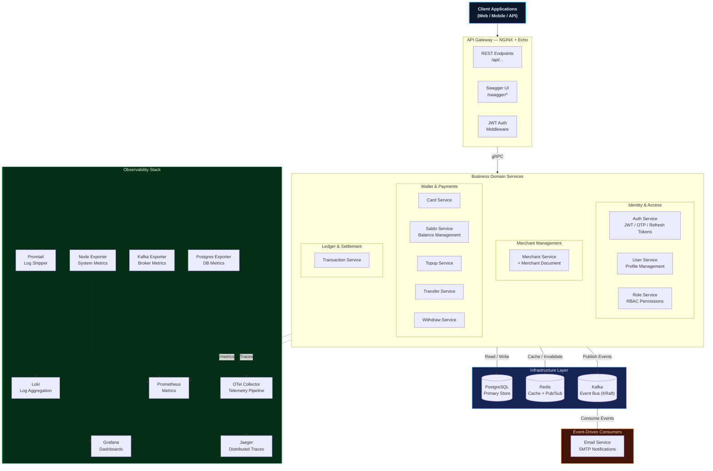
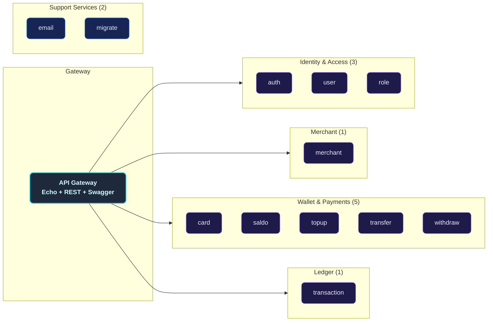
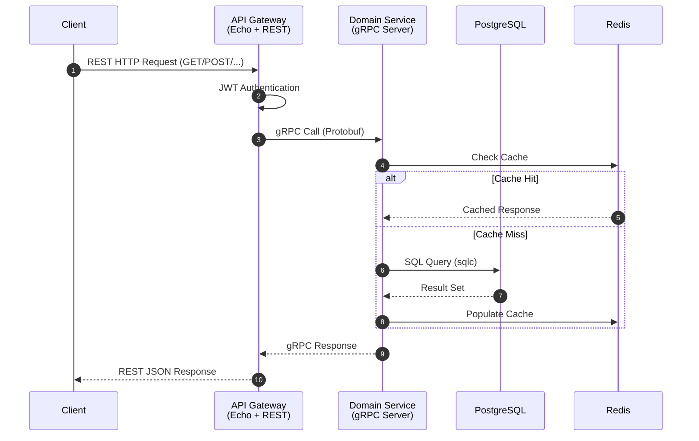
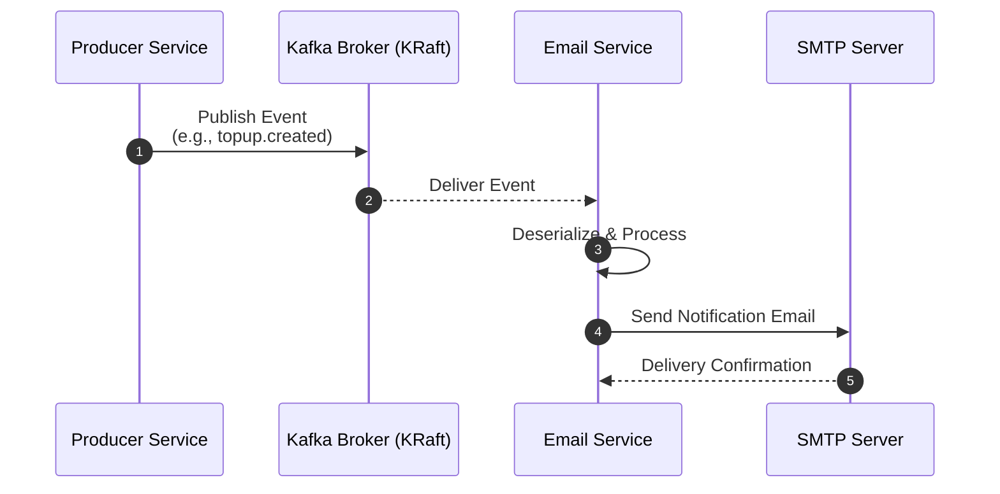
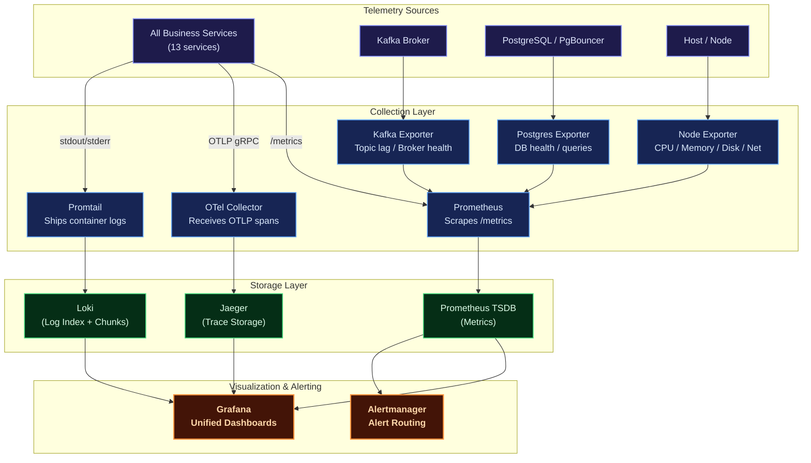
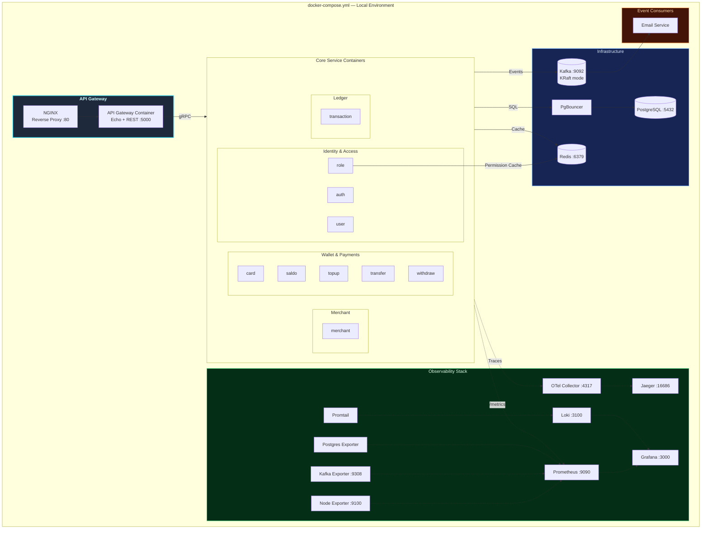
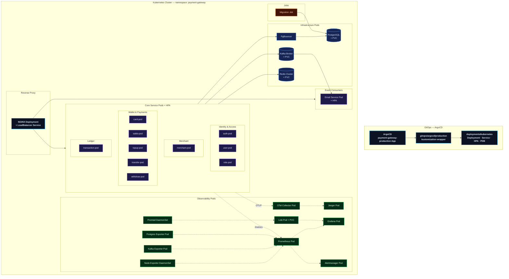

# Distributed Modular Monolith — Payment Gateway Platform

A production-grade, **modular-monolith payment gateway backend** built with **Go (Golang)**, designed around domain-driven service boundaries while retaining the operational simplicity of a single deployment unit. Each business domain — Users, Roles, Merchants, Cards, Saldo (Balance), Topup, Transfer, Withdraw, Transactions — lives in its own self-contained module with a clean internal architecture, yet all modules ship as independently deployable containers that communicate via **gRPC** and asynchronous **Kafka** events.

The platform ships with a **full observability stack** (Prometheus, Grafana, Loki, Jaeger, OpenTelemetry), **Redis caching** with instrumented metrics, **circuit-breaker & rate-limiting** resilience patterns, and **Kubernetes** manifests delivered via **ArgoCD** GitOps (namespace `payment-gateway`), featuring Horizontal Pod Autoscalers (HPA) and Pod Disruption Budgets (PDB) per service.

---

## Key Features

| Domain | Capabilities |
|--------|-------------|
| **Auth & Users** | Registration, login, JWT access/refresh tokens, password recovery & OTP verification, role-based authorization (RBAC) |
| **Merchants** | Merchant onboarding, credentials/document verification, merchant status lifecycle |
| **Cards** | Card profile management, card status, dashboard & balance/topup/transaction/transfer/withdraw statistics |
| **Saldo (Balance)** | Balance account management, balance statistics |
| **Topup** | Top-up transactions with method/status/amount statistics |
| **Transfer** | Peer-to-peer fund transfers with status/amount statistics |
| **Withdraw** | Withdrawal processing with status/amount statistics |
| **Transactions** | Payment recording, status tracking, event-driven confirmation pipelines |
| **Notifications** | Kafka-driven email service for auth, merchant, and financial-event confirmations |
| **Observability** | Metrics (Prometheus + Grafana), Logging (Loki + Promtail), Tracing (Jaeger + OpenTelemetry), System metrics (Node Exporter), Kafka metrics (Kafka Exporter), Postgres metrics (Postgres Exporter) |
| **Deployment** | Docker Compose for local dev, Kubernetes manifests + ArgoCD GitOps for production |

---

## Architecture Overview

The platform follows a **Distributed Modular Monolith** architecture — each module is a self-contained Go binary with its own clean-architecture internals, deployed as an independent container. An **API Gateway** (NGINX + Echo) provides a unified **REST API** entry point, translating HTTP requests into gRPC calls to downstream services.

### Core Architecture Principles

- **Single Responsibility**: Each service owns its domain logic, data access, and caching layer
- **Clean Architecture**: Every service follows `handler → service → repository` with clear dependency injection
- **Event-Driven Decoupling**: Kafka enables asynchronous communication without direct service dependencies
- **Observability-First**: Every service is instrumented with OpenTelemetry traces, Prometheus metrics, and structured logging
- **Resilience Patterns**: Built-in circuit breakers, request rate limiters, and load monitors in the shared `pkg/resilience` package



---

## Service Catalog

The platform is composed of **13 independently deployable services** plus supporting infrastructure:



---

## Internal Service Architecture

Every business service follows a **Clean Architecture** pattern with strict layering. Dependencies flow inward, keeping the core business logic free from infrastructure concerns.

```mermaid
graph TB
    classDef handler fill:#1e3a5f,stroke:#7dd3fc,color:#e0f2fe,stroke-width:1.5px
    classDef service fill:#1e1b4b,stroke:#a78bfa,color:#ede9fe,stroke-width:1.5px
    classDef repo fill:#172554,stroke:#60a5fa,color:#dbeafe,stroke-width:1.5px
    classDef infra fill:#052e16,stroke:#4ade80,color:#dcfce7,stroke-width:1.5px
    classDef shared fill:#431407,stroke:#fb923c,color:#fed7aa,stroke-width:1.5px

    subgraph Service["service/<name>/"]
        direction TB

        CMD["cmd/main.go<br/>Entry Point"]
        APPS["apps/<br/>Dependency Wiring"]:::handler
        HANDLER["handler/<br/>gRPC Handlers"]:::handler
        MW["middlewares/<br/>Interceptors"]:::handler
        SVC["service/<br/>Business Logic"]:::service
        REDISCACHE["redis/<br/>Redis Cache Layer"]:::service
        REPO["repository/<br/>Data Access (sqlc)"]:::repo

        CMD --> APPS
        APPS --> HANDLER
        APPS --> SVC
        APPS --> REDISCACHE
        APPS --> REPO
        HANDLER --> SVC
        SVC --> REPO
        SVC --> REDISCACHE
    end

    subgraph SharedLibs["shared/ — Shared Libraries"]
        direction LR
        DOMAIN["domain/<br/>record / requests / response"]:::shared
        OBS["observability/<br/>cache_metrics / tracing_metrics"]:::shared
        CACHESHARED["cache/<br/>redis_cache.go"]:::shared
        MAPPER["mapper/<br/>Domain ↔ Proto"]:::shared
        CONVERT["convert/<br/>Env / Type Helpers"]:::shared
        ERRORS["errors/ + errorhandler/<br/>per-domain error types"]:::shared
    end

    subgraph PkgLibs["pkg/ — Platform Libraries"]
        direction LR
        PKGAUTH["auth/<br/>JWT Manager"]:::infra
        PKGKAFKA["kafka/<br/>Producer / Consumer"]:::infra
        PKGOTEL["otel/<br/>Tracing + Metrics Init"]:::infra
        PKGRES["resilience/<br/>Circuit Breaker<br/>Rate Limiter<br/>Load Monitor"]:::infra
        PKGLOG["logger/<br/>Zap Structured Logging"]:::infra
        PKGSRV["server/<br/>gRPC Server Bootstrap"]:::infra
        PKGDB["database/<br/>PostgreSQL + Migrations<br/>+ Seeders"]:::infra
        PKGOUTBOX["outbox/<br/>Transactional Outbox<br/>+ Consumer Inbox"]:::infra
    end

    REPO --> DOMAIN
    SVC --> DOMAIN
    SVC --> OBS
    HANDLER --> MAPPER
    APPS --> PKGSRV
    APPS --> PKGOTEL
    APPS --> CACHESHARED
    APPS --> OBS
```



> Generated protobuf code lives in the root-level `pb/` module (source: `proto/`), and is imported by services and the gateway alike.

---

## Data & Event Flow

### Synchronous Flow (gRPC)

All client-facing requests flow through the API Gateway, which forwards them over gRPC to the appropriate domain service.



### Asynchronous Flow (Kafka Events)

Services publish domain events to Kafka topics. Downstream consumers (e.g., Email Service) react to these events without coupling to the producer.



---

## Kafka & Event-Driven Architecture

Platform menggunakan Apache Kafka sebagai event backbone untuk **notifikasi
email asinkron**. Enam service mempublikasikan event ke **13 topik domain**,
dan satu service (email) menjadi satu-satunya consumer utama. Email service
juga memproses **1 topik retry** dan **1 topik DLQ** untuk kegagalan SMTP
sementara. Full audit dokumentasi ada di [`service/email/README.md`](service/email/README.md)
dan per-service `README.md`.

### Topologi Topik (13 topik domain + retry/DLQ)

| Topik | Producer | Fungsi |
|:------|:---------|:-------|
| `email-service-topic-auth-register` | auth | Email selamat datang + verifikasi |
| `email-service-topic-auth-forgot-password` | auth | Email OTP reset password |
| `email-service-topic-auth-verify-code-success` | auth | Email verifikasi sukses |
| `email-service-topic-saldo-create` | saldo | Email saldo dibuat |
| `email-service-topic-topup-create` | topup | Email top-up sukses |
| `email-service-topic-transfer-create` | transfer | Email transfer sukses |
| `email-service-topic-withdraw-create` | withdraw | Email withdraw dibuat |
| `email-service-topic-withdraw-update` | withdraw | Email status withdraw diperbarui |
| `email-service-topic-transaction-create` | transaction | Email transaksi baru |
| `email-service-topic-merchant-create` | merchant | Email pembuatan akun merchant |
| `email-service-topic-merchant-update-status` | merchant | Email perubahan status merchant |
| `email-service-topic-merchant-document-create` | merchant | Email dokumen merchant dibuat |
| `email-service-topic-merchant-document-update-status` | merchant | Email status dokumen merchant |
| `email-service-topic-email-retry` | email (internal) | Retry pengiriman SMTP yang gagal sementara |
| `email-service-topic-email-dlq` | email (internal) | Dead-letter untuk event yang gagal total |

Konvensi penamaan: `email-service-topic-<domain>-<event>`. Semua topik
dibuat otomatis oleh broker (`KAFKA_AUTO_CREATE_TOPICS_ENABLE=true`).

### Producer & Consumer Matrix

| Service | Produce | Consume |
|:--------|:--------|:--------|
| auth | 3 topik | — |
| saldo | 1 topik | — |
| topup | 1 topik | — |
| transfer | 1 topik | — |
| withdraw | 2 topik | — |
| transaction | 1 topik | — |
| merchant | 4 topik | — |
| email | 2 topik (retry + DLQ) | 14 topik (13 domain + 1 retry; DLQ tidak dikonsumsi) |
| lainnya (user, role, card) | — | — |

### Transactional Outbox Pattern

Semua producer email menulis event ke tabel **`outbox_events`** dalam transaksi
DB yang sama dengan data bisnisnya (Phase 6, 2026-08-16). Relay `pkg/outbox`
mengirim ke Kafka secara async dengan **retry 5x + backoff eksponensial + dead-letter**
(status `dead` untuk event yang gagal total).

```text
DB commit + outbox insert ──(atomic)──► Relay publikasi ──► Kafka send ──► Email consumer
                                        retry 5x + backoff        inbox dedup → email sekali
```

> **Jaminan inti:** insert data bisnis + insert outbox dalam transaksi DB
> yang sama → Kafka down tidak kehilangan event. Event tetap aman di DB
> dan terkirim saat broker kembali.

### Consumer Inbox & Email Deduplication

Consumer menggunakan **PostgreSQL-backed inbox** (`pkg/outbox` → `NewPostgresInbox`)
untuk **deduplikasi durable** dan **retry-topic offloading** pada kegagalan SMTP
sementara:

- **Dedup:** event yang sudah diproses (per topic + partition + offset) tidak
  dikirim ulang, bahkan setelah restart consumer.
- **Retry:** kegagalan SMTP sementara dipindahkan ke `email-service-topic-email-retry`
  dengan `max attempts 5` dan backoff default 30s (`pkg/emailretry`).
- **DLQ:** event yang menghabiskan seluruh percobaan masuk ke
  `email-service-topic-email-dlq` untuk investigasi manual.

### Graceful Degradation

| Kondisi | Perilaku |
|:--------|:---------|
| Kafka tidak diinisialisasi | Warn + skip event, operasi utama tetap sukses |
| Email tujuan tidak ditemukan | Warn + skip event |
| `sendMessage` gagal | Error di-log, caller `.recover` → operasi tetap sukses |
| SMTP down | Event dipindahkan ke retry topic (bukan langsung hilang); offset tidak maju sampai sukses |

### Operational CLI

```sh
docker compose -f deployments/local/docker-compose.yml exec kafka bash

# List topik
/opt/kafka/bin/kafka-topics.sh --bootstrap-server localhost:9092 --list

# Cek lag consumer
/opt/kafka/bin/kafka-consumer-groups.sh --bootstrap-server localhost:9092 \
  --group email-service-group --describe
```

### Design Notes

- **`acks=1`** — kompromi latency vs durability; event bisa hilang jika
  leader crash sebelum replikasi (covered by outbox).
- **Kafka exporter** memantau lag consumer + broker health via Prometheus.

---

## Observability Architecture

The platform implements all **Three Pillars of Observability** — Metrics, Logs, and Traces — with a unified visualization layer.



| Pillar | Tool | Purpose |
|--------|------|---------|
| **Metrics** | Prometheus + Grafana | Request rates, error rates, latency percentiles, cache hit ratios, system resource utilization |
| **Logging** | Loki + Promtail | Structured JSON logs from all services, queryable via LogQL in Grafana |
| **Tracing** | Jaeger + OpenTelemetry | End-to-end distributed trace visualization, latency breakdown per service hop |
| **Alerting** | Alertmanager | Alert routing and notification for metric threshold breaches |

---

## Deployment Architectures

### Docker Compose (Local Development)

The Docker Compose setup provides a complete local development environment with all services, databases, message brokers, and observability tools orchestrated in a single command.



### Kubernetes (Production)

The Kubernetes manifests are organized as a flat directory under
`deployments/kubernetes/` — each service has its own Deployment, Service, and
HPA YAML files. Pod Disruption Budgets (PDB) are consolidated in
`p2-policy.yaml` (8 PDBs across all services). Delivery is GitOps-driven via
**ArgoCD** (`deployments/gitops/argocd/`): the `payment-gateway-production`
Application points directly at `deployments/kubernetes/` and self-heals/prunes
on every push to `main`. Every service runs in namespace `payment-gateway`
with initContainers that wait for Kafka and fix log volume permissions before
the main container starts.



---

## Technology Stack

| Category | Technology | Purpose |
|----------|-----------|---------|
| **Language** | Go (Golang) | High-performance, statically typed backend |
| **API Framework** | Echo (v4) | REST API Gateway framework |
| **RPC** | gRPC + Protobuf | High-performance inter-service communication |
| **Database** | PostgreSQL | Primary relational data store |
| **Connection Pooler** | PgBouncer | PostgreSQL connection pooling for high concurrency |
| **SQL Codegen** | sqlc | Type-safe SQL → Go code generation |
| **Migrations** | Goose | Database schema migration management |
| **Caching** | Redis | In-memory cache with instrumented metrics |
| **Messaging** | Apache Kafka (KRaft) | Asynchronous event-driven communication (no Zookeeper) |
| **Auth** | JWT | Stateless authentication & authorization |
| **Logging** | Zap | High-performance structured logging |
| **Metrics** | Prometheus | Metric collection & alerting rules |
| **Log Aggregation** | Loki + Promtail | Centralized log storage & shipping |
| **Dashboards** | Grafana | Unified metric, log, and trace visualization |
| **Alerting** | Alertmanager | Alert routing & notification dispatch |
| **System Metrics** | Node Exporter | Host-level CPU / Memory / Disk / Network metrics |
| **Kafka Metrics** | Kafka Exporter | Broker health, topic lag, consumer group metrics |
| **DB Metrics** | Postgres Exporter | PostgreSQL health, connection & query metrics |
| **Telemetry Pipeline** | OTel Collector | Vendor-agnostic telemetry receive, process, export |
| **Reverse Proxy** | NGINX | API routing, load balancing, TLS termination |
| **Containerization** | Docker + Docker Compose | Container image building & local orchestration |
| **Orchestration** | Kubernetes | Production-grade container orchestration with HPA |
| **Manifest Management** | Kubernetes YAML + Kustomize | Per-service Deployment/Service/HPA + consolidated PDBs, ArgoCD kustomization wrapper |
| **GitOps Delivery** | ArgoCD | `payment-gateway-production` Application syncing `deployments/kubernetes/` — self-heal + prune on push to `main` |
| **API Docs** | Swagger UI | Interactive API documentation (echo-swagger) — 242 endpoints (11 domain), annotations per-route + skema auth `BearerAuth` |
| **Load Testing** | k6 | Read baseline, CRUD lifecycle, and financial idempotency/concurrency scenarios |
| **Resilience** | Circuit Breaker, Rate Limiter, Load Monitor | Built-in fault tolerance patterns (`pkg/resilience`) |

---

## Getting Started

### Prerequisites

Ensure the following tools are installed on your system:

- [Git](https://git-scm.com/)
- [Go](https://go.dev/) (v1.25+)
- [Docker](https://www.docker.com/) & [Docker Compose](https://docs.docker.com/compose/)
- [Just](https://github.com/casey/just) (task runner)
- [Protobuf Compiler](https://grpc.io/docs/protoc-installation/) (for proto generation)

For `just generate-proto` you also need the Go protoc plugins on `PATH`
(well-known types like `google/protobuf/empty.proto` are already vendored,
so no system include dir is required):

```sh
go install google.golang.org/protobuf/cmd/protoc-gen-go@latest
go install google.golang.org/grpc/cmd/protoc-gen-go-grpc@latest
# ensure $(go env GOPATH)/bin is on PATH, e.g.:
# export PATH="$(go env GOPATH)/bin:$PATH"
```

### 1. Clone the Repository

```sh
git clone https://github.com/MamangRust/monolith-payment-gateway-grpc.git
cd monolith-payment-gateway-grpc
```

### 2. Configure Environment

The environment files are already tracked in the repository — edit them directly to match your local setup:

```sh
# Root-level configuration (already present in repo)
# .env

# Docker-specific overrides
# deployments/local/docker.env
# deployments/local/local.env
```

Edit the `.env` and `deployments/local/docker.env` files to match your local setup (database credentials, Kafka brokers, Redis addresses, etc.).

### 3. Build & Launch (Docker Compose)

```sh
# Build all service images and start the full stack
just build-up

# Run database migrations
just migrate

# (Optional) Seed the database with sample data
just seeder
```

The platform is now fully operational. Verify with:

```sh
just ps
```

### 4. Access Services

| Service | URL |
|---------|-----|
| Swagger UI (via Nginx) | `http://localhost:80/swagger/index.html` |
| Swagger UI (Direct) | `http://localhost:5000/swagger/index.html` |
| Swagger JSON (Direct) | `http://localhost:5000/swagger/doc.json` |
| API Endpoints (via Nginx) | `http://localhost:80/api/` |
| API Endpoints (Direct) | `http://localhost:5000/api/` |
| Grafana Dashboards | `http://localhost:3000` |
| Prometheus | `http://localhost:9090` |
| Jaeger UI | `http://localhost:16686` |
| Loki (via Grafana) | `http://localhost:3000` → Explore → Loki |

> **Swagger docs**: 242 route ter-annotasi penuh (11 domain) dengan tipe request/response
> dan skema auth BearerToken (`BearerAuth`). Endpoint publik (`/api/auth/hello`, `/api/auth/login`,
> `/api/auth/register`, dll.) ditandai tanpa `security`; sisanya memerlukan `Authorization: Bearer <token>`.

### Stopping the Platform

```sh
just down
```

---

## Justfile Commands

The project uses a single `justfile` as its task runner:

| Command | Description |
|---------|-------------|
| `just build-up` | Build all Docker images and start the entire stack |
| `just up` | Start all services (images must already be built) |
| `just down` | Stop and remove all running containers |
| `just ps` | Show status of all running containers |
| `just migrate` | Run database schema migrations (up) |
| `just migrate-down` | Rollback database migrations |
| `just seeder` | Seed the database with sample data |
| `just build` | Build all services to `bin/` |
| `just generate-proto` | Regenerate Go code from `.proto` definitions (`proto/` → `pb/`) |
| `just generate-sql` | Regenerate Go code from SQL queries (sqlc) |
| `just generate-swagger` | Regenerate Swagger docs via `swag init -g service/apigateway/cmd/main.go -o service/apigateway/docs` (242 ops / 180 definitions) |
| `just generate-mocks` | Regenerate gomock mocks for all services and `pkg/` |
| `just build-image` | Build Docker images for all services (context = repo root; docker or podman) |
| `just image-load` | Load Docker images into Minikube |
| `just image-delete` | Delete service images from Minikube |
| `just tidy-all` | Run `go mod tidy` in every service module |
| `just kube-start` | Start Minikube with the docker driver |
| `just kube-up` | Apply Kubernetes manifests (namespace + deployments) |
| `just kube-down` | Delete Kubernetes manifests |
| `just kube-status` | Show pods/services/PVCs/jobs in namespace `payment-gateway` |
| `just kube-tunnel` | Open a Minikube tunnel |
| `just test-unit` | Run mock-based unit tests in `tests/` (`-short`, race detector) |
| `just test-pkg` | Run unit tests in `pkg/` |
| `just test-integration` | Run testcontainers integration tests (auto-detects Docker/Podman) |
| `just test-all` | Run unit + pkg + integration tests sequentially |
| `just test-ci` | CI test suite (unit + pkg, race detector) |
| `just p2-read-baseline` | Run safe read-only k6 performance baseline |
| `just k6-crud-lifecycle` | Run configurable k6 CRUD lifecycle suite (financial deletes disabled by default) |
| `just k6-financial-concurrency` | Run financial idempotency replay/concurrency for one domain |

---

## Project Structure

```
monolith-payment-gateway-grpc/
├── proto/                         # Protobuf definitions (11 domain .proto + vendored WKT)
├── pb/                            # Generated protobuf Go module
├── shared/                        # Shared Go module
│   ├── domain/                    #   Domain models (record/request/response)
│   ├── mapper/                    #   Domain ↔ Protobuf mappers
│   ├── cache/                     #   Redis cache abstraction
│   ├── observability/             #   Cache metrics + tracing metrics
│   ├── convert/                   #   Env / type conversion helpers
│   ├── errors/                    #   Per-domain error types (auth_errors, role_errors, ...)
│   └── errorhandler/              #   Error handling utilities
├── pkg/                           # Platform-level Go module
│   ├── auth/                      #   JWT token manager
│   ├── database/                  #   PostgreSQL connection + migrations + seeders
│   ├── kafka/                     #   Kafka producer/consumer wrapper
│   ├── outbox/                    #   Transactional outbox relay + consumer inbox
│   ├── otel/                      #   OpenTelemetry initialization
│   ├── resilience/                #   Circuit breaker, rate limiter, load monitor
│   ├── logger/                    #   Zap structured logger (otelzap bridge)
│   ├── server/                    #   gRPC server bootstrap
│   ├── middleware/                #   Shared middleware
│   ├── email/                     #   Email client
│   ├── emailretry/                #   Email send retry logic (retry topic + DLQ)
│   ├── event/                     #   Event definitions/registry
│   ├── hash/                      #   Password hashing
│   ├── dotenv/                    #   Environment loader
│   ├── redis/                     #   Redis client helpers
│   ├── api-key/                   #   API key handling
│   ├── random_string/             #   Random string generator
│   ├── randomvcc/                 #   Random virtual card number generator
│   ├── rupiah/                    #   IDR currency formatting/parsing
│   ├── date/                      #   Date helpers
│   ├── method_topup/              #   Top-up method registry
│   ├── adapter/                   #   Adapters (payment channels, etc.)
│   ├── trace_unic/                #   Trace ID utilities
│   └── ...                        #   Other platform utilities
├── service/                       # All microservices
│   ├── apigateway/                #   REST API Gateway (Echo + Swagger)
│   ├── auth/                      #   Authentication service (JWT + OTP)
│   ├── user/                      #   User management
│   ├── role/                      #   RBAC role management
│   ├── merchant/                  #   Merchant core + merchant document
│   ├── card/                      #   Card management + statistics
│   ├── saldo/                     #   Balance account management
│   ├── topup/                     #   Top-up processing
│   ├── transfer/                  #   Fund transfer processing
│   ├── withdraw/                  #   Withdrawal processing
│   ├── transaction/               #   Payment/transaction processing
│   ├── email/                     #   Email notification consumer (inbox + retry/DLQ)
│   └── migrate/                   #   Database migration runner
├── seeder/                        #   Database seeder (dev/CI tooling)
├── deployments/
│   ├── local/                     #   Docker Compose (docker.env / local.env)
│   ├── kubernetes/                #   Flat Kubernetes manifests (Deployment/Service/HPA/PDB)
│   └── gitops/argocd/             #   ArgoCD Application + kustomization wrapper
├── observability/                 #   Prometheus rules, Loki, OTel, Promtail configs
├── grafana/                       #   Grafana dashboard provisioning
├── nginx/                         #   NGINX reverse proxy configuration
├── redis/                         #   Redis configuration
├── k6/                            #   Load testing scenarios (read baseline, CRUD, financial)
├── tests/                         #   Unit + integration test module (testcontainers)
├── hurl/                          #   Hurl-based E2E test scripts
└── images/                        #   Documentation screenshots
```

---

## License

This project is open-sourced for educational and development purposes.

---

<p align="center">
  Built with Go, gRPC, and a passion for clean architecture.
</p>
